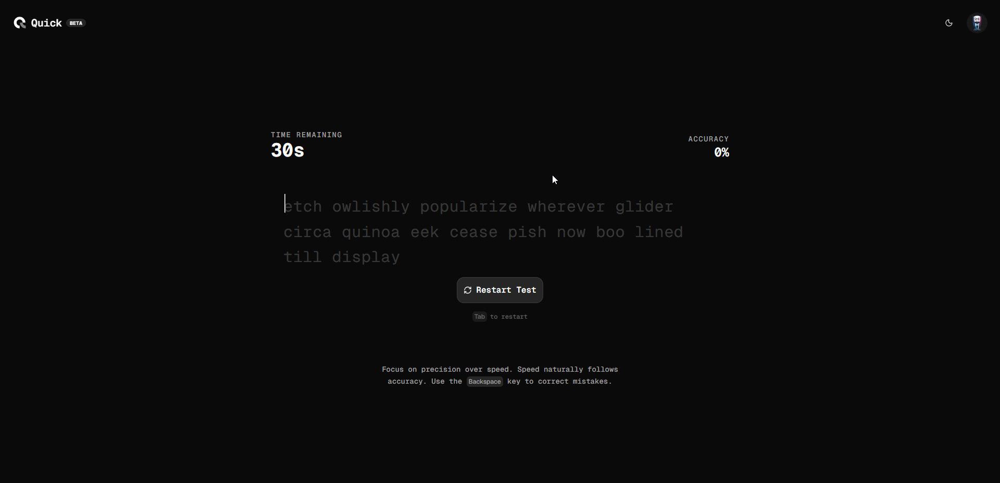
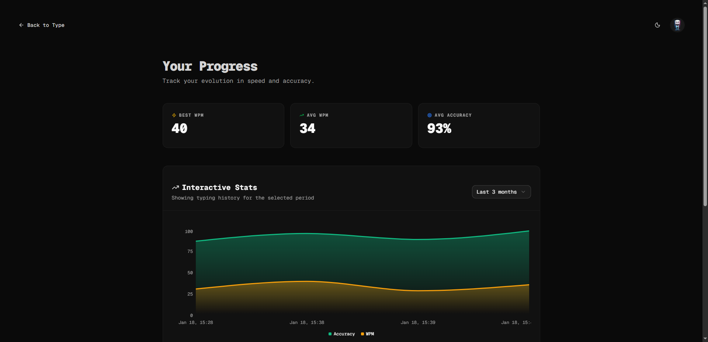
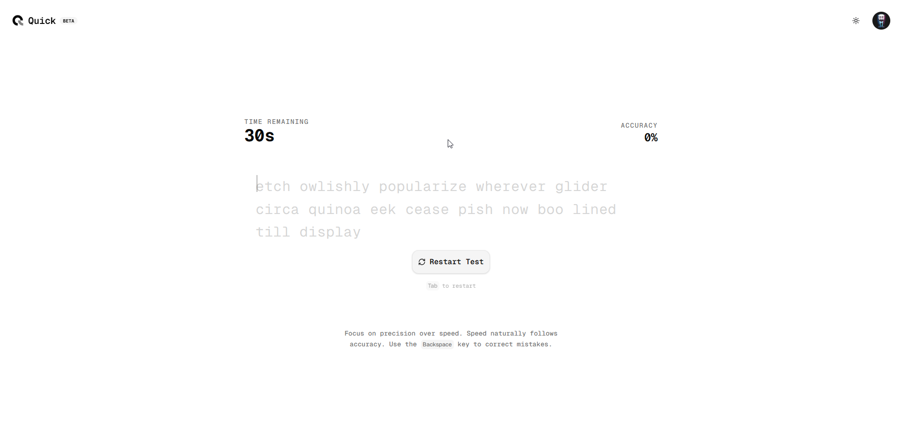

# Quick ⚡

Quick is a high-performance, modern speed typing application built to help you master the keyboard. Track your progress with interactive charts, analyze your accuracy, and push your limits with a sleek, distraction-free environment.

## 📱 App Demo

<div align="center">
  
  
  <br />
  
  
</div>

## ✨ Features

- **Dynamic Typing Engine**: Real-time WPM and accuracy calculations with instant error feedback.
- **Interactive Dashboards**: Deep-dive into your typing history with advanced Area Charts showing your evolution over time.
- **Premium UI/UX**: Built with Framer Motion for ultra-smooth animations and Shadcn UI for a professional look.
- **Secure Authentication**: Multiple login methods (Email/Password, Google) powered by Better-Auth.
- **Session Management**: Full control over your active sessions and account security.
- **Theming**: Elegant dark and light modes that are easy on the eyes during long typing sessions.
- **Data Persistence**: Automatically saves every test result to your cloud profile.

## 🛠️ Tech Stack

- **Framework**: [Next.js 15+](https://nextjs.org/)
- **Styling**: [Tailwind CSS](https://tailwindcss.com/)
- **Components**: [Shadcn UI](https://ui.shadcn.com/)
- **Animations**: [Framer Motion](https://www.framer.com/motion/)
- **Database**: [PostgreSQL (Neon)](https://neon.tech/)
- **ORM**: [Prisma](https://www.prisma.io/)
- **Auth**: [Better-Auth](https://better-auth.com/)
- **Charts**: [Recharts](https://recharts.org/)
- **State/Hooks**: Custom typing engine hook with high-frequency updates.

## 🚀 Getting Started

### Prerequisites

- Node.js 18+
- A PostgreSQL database (e.g., Neon Cloud)

### Installation

1. **Clone the repository:**
   ```bash
   git clone https://github.com/lwshakib/quick-speed-typing.git
   cd quick-speed-typing
   ```

2. **Install dependencies:**
   ```bash
   npm install
   ```

3. **Set up Environment Variables:**
   Create a `.env` file in the root directory:
   ```env
   DATABASE_URL="your-postgresql-url"
   NEXT_PUBLIC_BASE_URL="http://localhost:3000"
   BETTER_AUTH_SECRET="your-secret"
   BETTER_AUTH_URL="http://localhost:3000"
   GOOGLE_CLIENT_ID="your-google-client-id"
   GOOGLE_CLIENT_SECRET="your-google-client-secret"
   ```

4. **Initialize Database:**
   ```bash
   npx prisma db push
   ```

5. **Run the development server:**
   ```bash
   npm run dev
   ```

Open [http://localhost:3000](http://localhost:3000) with your browser to start typing!

## 🤝 Contributing

Contributions are what make the open-source community such an amazing place to learn, inspire, and create. Any contributions you make are **greatly appreciated**.

Please see `CONTRIBUTING.md` for more details.

## 📄 License

Distributed under the MIT License. See `LICENSE` for more information.

---

Built with ❤️ by [lwshakib](https://github.com/lwshakib)
