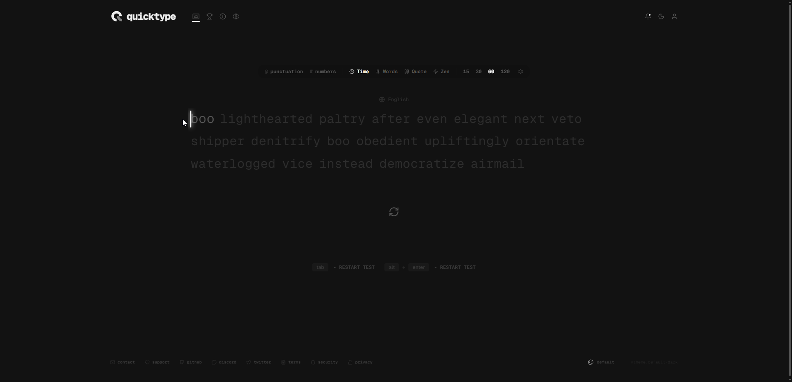
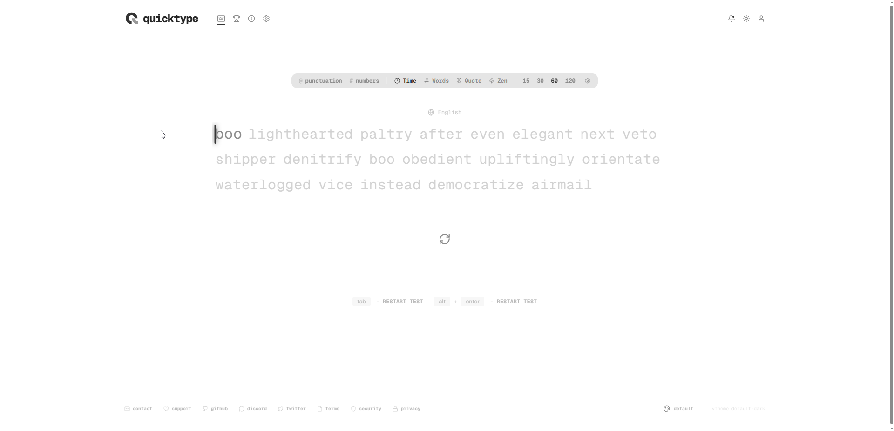

#  Quicktype

Quicktype is a high-performance, minimalist, and modern speed typing application designed to help you master the keyboard. Built with a focus on speed, precision, and aesthetics, it provides a distraction-free environment with real-time analytics and deep progress tracking.

---

## 📱 App Preview

### 🌑 Dark Mode
The definitive typing experience with curated themes like Carbon and Serika Dark.
<div align="center">
  
</div>

<br />

### ☀️ Light Mode
Clean, high-contrast interface for maximum legibility and focus.
<div align="center">
  
</div>

---

## ✨ Features

- **🎯 Precision Typing Engine**: Real-time WPM, raw WPM, and accuracy calculations.
- **📈 Advanced Analytics**: Interactive Recharts-powered graphs showing your typing evolution during each test.
- **🧘 Zen Mode**: A minimalist, free-flow typing mode for pure practice without timers or distractions.
- **🎭 Theme Engine**: Polished, curated themes that adapt perfectly to your environment.
- **📊 History Tracking**: Persistent history of your performances, saved to your cloud profile.
- **⌨️ Multi-Mode Practice**: Supports Time-based, Word-count based, and Quote-based typing tests.
- **⚙️ Customizable Config**: Toggle punctuation, numbers, and change languages on the fly.
- **🛡️ Secure Auth**: Multiple sign-in methods powered by Better-Auth and Prisma.

---

## 🛠️ Tech Stack

- **Framework**: [Next.js 15+](https://nextjs.org/) (App Router, Server Actions)
- **Styling**: [Tailwind CSS](https://tailwindcss.com/)
- **Components**: [Shadcn UI](https://ui.shadcn.com/)
- **Animations**: [Framer Motion](https://www.framer.com/motion/)
- **Database**: [PostgreSQL (Neon)](https://neon.tech/)
- **ORM**: [Prisma](https://www.prisma.io/)
- **Auth**: [Better-Auth](https://better-auth.com/)
- **Charts**: [Recharts](https://recharts.org/)
- **State Management**: [Zustand](https://zustand-demo.pmnd.rs/)

---

## 🚀 Getting Started

### Prerequisites

- Node.js 18+
- Bun (recommended) or NPM
- A PostgreSQL database (Neon Cloud or local)

### Installation

1. **Clone the repository:**
   ```bash
   git clone https://github.com/lwshakib/quick-speed-typing.git
   cd quick-speed-typing
   ```

2. **Install dependencies:**
   ```bash
   bun install
   ```

3. **Environment Setup:**
   Create a `.env` file in the root:
   ```env
   DATABASE_URL="postgresql://..."
   NEXT_PUBLIC_BASE_URL="http://localhost:3000"
   BETTER_AUTH_SECRET="your-secret"
   GOOGLE_CLIENT_ID="your-client-id"
   GOOGLE_CLIENT_SECRET="your-client-secret"
   ```

4. **Database Initialization:**
   ```bash
   npx prisma db push
   ```

5. **Run Development Server:**
   ```bash
   bun dev
   ```

---

## 🤝 Contributing

We welcome contributions! Please see our [Contributing Guide](CONTRIBUTING.md) and [Code of Conduct](CODE_OF_CONDUCT.md).

## 📄 License

Distributed under the MIT License. See `LICENSE` for more information.

---

<p align="center">
  Built with ❤️ by <a href="https://github.com/lwshakib">lwshakib</a>
</p>
